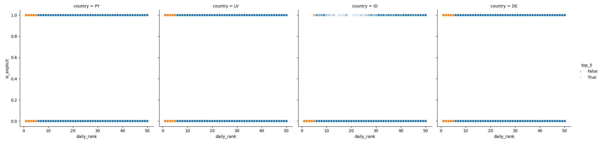

# Building a predictive model for songs ranking in top 5
##### Capstone project 2
With the development of the internet, cultural globalization has accelerated significantly. Faster internet speeds and widespread network accessibility have effectively dissolved the borders between countries, especially in the realm of music. The internet enables songs to be heard globally within moments of their release and fosters the fusion of diverse musical styles, artists, and instruments, creating new genres that reflect our increasingly multicultural world.

Platforms like Spotify and Apple Music provide a global stage for music, allowing us to track the performance of various songs and genres across different regions. This vast availability of data offers an unprecedented opportunity to analyze and uncover the patterns and characteristics that contribute to a song's success on a global scale. By examining song attributes and socio-economic indicators of different countries, this project aims to develop a predictive model to determine whether a song will reach the top 5.

## Data
The data utilized in this project was sourced from multiple Kaggle datasets. The 2 main datasets include information from Spotify, encompassing song rankings and key audio features such as danceability, energy, loudness, speechiness, acousticness, instrumentalness, liveness, valence, tempo, duration, and time signature. Socio-economic indicators were obtained from the 3 last datasets and integrated into the analysis to provide a comprehensive view. These combined data sources form the basis for developing the predictive model.

__[Song Attributes](https://www.kaggle.com/datasets/byomokeshsenapati/spotify-song-attributes?resource=download)__

__[Top Songs Spotify](www.kaggle.com/datasets/asaniczka/top-spotify-songs-in-73-countries-daily-updated)__

__[Religion and happiness index](https://www.kaggle.com/datasets/vibhorsen/countries-by-population-happiness-index-religion)__

__[Socio-Economic Indicators](https://www.kaggle.com/datasets/toriqulstu/global-socio-economic-and-environmental-indicators)__

__[Socio-Economic spread of countries](https://www.kaggle.com/datasets/sumairseth/socioeconomic-spread-of-countries?resource=download)__

It is worth nothing, several of these datasets get updated regularly. The data used was downloaded in May 2024.

## Data Cleaning

__[Data Wrangling](https://github.com/alfredoh90/CAPSTONE2/blob/main/Notebooks/data_wrangling.ipynb)__

<ul>
    <li>Regarding the Spotify data, we found little missing values. the data represents one country and song position on a specific date on a specific country, and for missing countries it was the global ranking.</li>
    <li>There were <10 records with some sort of missing data (outside of the country) which could not be reconstructed. these were droped out of the dataset.</li>
    <li>We found some songs are "relaunched" a couple of times, decided to keep both re launches to see the impact on the prediction.</li>
    <li>The Socioeconomic indicators had to be built as a combination of the 3 different datasets merged using the country name. Some of the indicators included were:
        <ul>
        <li>Child mortaility, exports, health spending, imports, average net income per person, inflation, life expectancy, fertility rate and growe rate of gdp. </li>
        <li>Total population following the top religions (Christian, Muslim, Hindu...), as well as the country's happines score.</li>
        <li>Finally, the gross national income per capita, the human development index and the region for each country. </li>
        </ul>
</li>
    <li>The final step was combining the song characteristics with socioeconomic indicators and run a quick analysis of the data distribution. We found that all numeric features followed either a normal or uniform  distribution.</li>
</ul>

## Exploratory Data Analysis (EDA)

The first thing we did was identify the spread of daily_rank, we found a uniform distribution between 1 and 50. This is important as it shows we have the same number of songs in the top50 and we use them to predict the top5. Some of the other decisions we took were:
<ul>
    <li>Loudness is highly correlated to energy, We decided to keep only energy and drop loudness.</li>
    <li>Imports showed to have a very strong correlation with exports. We decided to combine them using the exports/imports rate.</li>
    <li>Income seemed to have strong correlation with gnipc and gdpp. As a results, we decided to drop income altogheter and keep gross national income per capita (gnipc) and gdpp.</li>
    <li>hdi_rank_202 also showed strong corrleation with several socioeconomic indicators. Because of this, we decided to remove the human development index (hdi_rank_2021) from the dataset. </li>
</ul>

Next, to identify the correlation between songs attributes and daily_rank, we chose to analyze 4 countries in parallel. The top 2 countries with the most songs on top5 and the 2 with the least. These countries were Indonesia, Paraguay, Latvia and Germany.

We found that some countries seem to only position songs in top5 that have high popularity (>80) while countries like Latvia and Germany have songs with lower popularity in top5.

We also found that Indonesia almost never places songs on top5 that are explicit.

This was an interesting fact that we wanted to test, so we sampled our data and ran a test to see if there is a difference on the average daily_rank of explicit and not explicit songs in indonesia. We found that explicit songs are normally distributed around 35 (in the top 50 rank), while non explicit are distributed around the position 25.

When running the same type of statistic analysis for tempo, we discovered that the average tempo of songs in the top 5 were significantly different than those not in top_5 for the 4 countries we reviewed.

## Modeling

When it came down to building the model for this project, we used the scikit learn library as it offers a range of efficient tools and techniques for data analysis, data mining, and predictive modeling. 

The metric we decided to use to optimize our model was the F1 score due to the imbalanced data we are working with.

For this project, we decided to run and compare multiple models to be able to choose the one with the best F1 score:
<dl>
    <dt>Constant</dt>
    <dd>The first model compared was a constant. This was the simples and fastest model, with the following results:
        <ul>
            <li>Balanced Accuracy: 50%</li>
            <li>Recall: 0%</li>
            <li>F1: 0</li>
        </ul>
    </dd>
    <dt>KNN Classifier</dt>
    <dd>The second model we tried was the KNN. While this model showed much better results, the time to run this increased by several minutes. The results obtained were:
        <ul>
            <li>Balanced Accuracy: 93.1%</li>
            <li>Recall: 87.5%</li>
            <li>F1: 0.88</li>
        </ul>
    </dd>
    <dt>Logistic Regression</dt>
    <dd>This was a much faster model to run. These were the results:
        <ul>
            <li>Balanced Accuracy: 55.5%</li>
            <li>Recall: 53.1%</li>
            <li>F1: 0.2</li>
        </ul>
    </dd>
    <dt>Random Forest</dt>
    <dd>The best model tested with a significant running time. These were the results:
        <ul>
            <li>Balanced Accuracy: 93.6%</li>
            <li>Recall: 88.2%</li>
            <li>F1: 0.891</li>
        </ul>
    </dd>
    <dt>Gradient Boosting</dt>
    <dd>Second fastest model with the following results:
        <ul>
            <li>Balanced Accuracy: 51.6%</li>
            <li>Recall: 3.4%</li>
            <li>F1: 0.064</li>
        </ul>
    </dd>
</dl>

#### Best model
The best model from the testing itterations was the Random Forest. After running a Bayesian optimization, we found that the best hyperparameters are:
<ul>
    <li>max_depth = 66</li>
    <li>min_samples_split = 2</li>
    <li>min_samples_leaf = 2</li>
    <li>n_extimators = 129</li>
</ul>
<dl>
    <dt>This model had the following results:</dt>
    <dd><ul>
            <li>Balanced Accuracy: 93.6%</li>
            <li>Recall: 88.2%</li>
            <li>F1: 0.893</li>
    </ul></dd>
</dl>

#### Metrics

__[Metrics](https://docs.google.com/spreadsheets/d/1ZVsb0Y4OL8LwjQd2s9vIV-xZxCPsGLCzdikKBjYmUI0/edit?gid=0#gid=0)__

#### Feature Importance
The "best"model identified showed that the most important features to predict a song making it to the top5 in a country is the days since release, followed by musical attributes like valence and energy and a much lower impact the religion and GDP of the country:

The model created can provide guidelines to the type of songs that are more likely to make it to the top5 but also can help predict wether a song will make it to the top5 based on the songs attributes as well as the country specific socio economic indicators.

## Next Steps
The next steps for this project should be to dive deeper into how this data can be modeled at a country level by potentially concentrating on countries with the most number of listeners or the best ROI for the music industry, where we can further understand the relationship of the songs attributes to the daily ranking and the likelihood of the song placing in the top5.